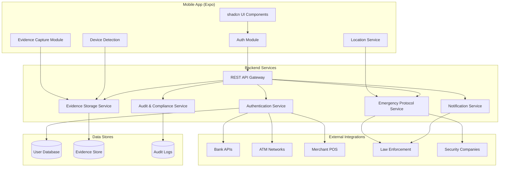

# TRANSRIFY Design Document

## Overview

TRANSRIFY is a secure authentication and verification platform that acts as a safety layer between users and financial institutions. The system provides dual PIN authentication where a normal PIN proceeds with standard verification, while a duress PIN triggers covert emergency protocols—alerting authorities and capturing evidence while appearing to function normally.

The mobile application is built with Expo (React Native) and shadcn-compatible UI components, communicating with a backend API that handles authentication, emergency protocols, evidence collection, and institutional integrations.

## Architecture



## Components and Interfaces

### Mobile Application Components

#### 1. Authentication Module
Handles PIN entry and validation requests to the backend.

```typescript
interface AuthModule {
  validatePin(userId: string, pin: string, institutionId: string): Promise<AuthResult>;
  registerUser(userData: UserRegistration): Promise<RegistrationResult>;
  setupDuressPin(userId: string, duressPin: string): Promise<SetupResult>;
}

interface AuthResult {
  success: boolean;
  verificationAdvice: VerificationAdvice;
  sessionToken?: string;
  error?: AuthError;
}

interface VerificationAdvice {
  status: 'authenticated' | 'failed';
  recommendedRouting: string;
  transactionLimits?: TransactionLimits;
}
```

#### 2. Evidence Capture Module
Captures GPS, video, audio, and nearby device data during emergencies.

```typescript
interface EvidenceCaptureModule {
  startCapture(sessionId: string): Promise<void>;
  stopCapture(sessionId: string): Promise<void>;
  captureLocation(): Promise<LocationData>;
  captureVideo(): Promise<MediaStream>;
  captureAudio(): Promise<MediaStream>;
  detectNearbyDevices(): Promise<DeviceInfo[]>;
}

interface LocationData {
  latitude: number;
  longitude: number;
  accuracy: number;
  timestamp: Date;
}

interface DeviceInfo {
  type: 'bluetooth' | 'wifi';
  identifier: string;
  signalStrength: number;
  timestamp: Date;
}
```

#### 3. Emergency Contact Manager
Manages emergency contacts and their notification preferences.

```typescript
interface EmergencyContactManager {
  addContact(contact: EmergencyContact): Promise<void>;
  removeContact(contactId: string): Promise<void>;
  getContacts(): Promise<EmergencyContact[]>;
  verifyContactConsent(contactId: string): Promise<boolean>;
}

interface EmergencyContact {
  id: string;
  name: string;
  phone?: string;
  email?: string;
  notificationChannels: NotificationChannel[];
  consentVerified: boolean;
  consentDate?: Date;
}

type NotificationChannel = 'sms' | 'push' | 'email';
```

### Backend Service Interfaces

#### 1. Authentication Service
Core service for PIN validation and verification advice generation.

```typescript
interface AuthenticationService {
  validateCredentials(request: ValidationRequest): Promise<ValidationResponse>;
  generateVerificationAdvice(userId: string, pinType: PinType): VerificationAdvice;
  hashPin(pin: string): string;
  comparePin(pin: string, hashedPin: string): boolean;
}

interface ValidationRequest {
  userId: string;
  pinHash: string;
  institutionId: string;
  transactionType: TransactionType;
  deviceFingerprint: string;
}

interface ValidationResponse {
  valid: boolean;
  pinType: PinType;
  verificationAdvice: VerificationAdvice;
  emergencyTriggered: boolean;
}

type PinType = 'normal' | 'duress';
type TransactionType = 'login' | 'atm' | 'pos' | 'transfer';
```

#### 2. Emergency Protocol Service
Orchestrates emergency response when duress PIN is detected.

```typescript
interface EmergencyProtocolService {
  initiateProtocol(userId: string, context: EmergencyContext): Promise<EmergencySession>;
  notifyOperationsCenter(session: EmergencySession): Promise<void>;
  notifyEmergencyContacts(session: EmergencySession): Promise<NotificationResult[]>;
  notifyLawEnforcement(session: EmergencySession): Promise<NotificationResult>;
  deactivateProtocol(sessionId: string, reason: string): Promise<void>;
}

interface EmergencyContext {
  location: LocationData;
  institutionId: string;
  transactionType: TransactionType;
  deviceInfo: DeviceFingerprint;
}

interface EmergencySession {
  id: string;
  userId: string;
  startTime: Date;
  status: 'active' | 'resolved' | 'escalated';
  context: EmergencyContext;
  evidencePortfolioId: string;
}
```

#### 3. Evidence Storage Service
Manages tamper-proof storage of emergency evidence.

```typescript
interface EvidenceStorageService {
  createPortfolio(sessionId: string): Promise<EvidencePortfolio>;
  appendEvidence(portfolioId: string, evidence: Evidence): Promise<void>;
  getPortfolio(portfolioId: string, accessorId: string): Promise<EvidencePortfolio>;
  verifyIntegrity(portfolioId: string): Promise<IntegrityResult>;
  generateEvidenceHash(evidence: Evidence): string;
}

interface EvidencePortfolio {
  id: string;
  sessionId: string;
  createdAt: Date;
  evidence: Evidence[];
  integrityChain: string[];
}

interface Evidence {
  id: string;
  type: 'location' | 'video' | 'audio' | 'device_scan';
  timestamp: Date;
  data: Buffer | LocationData | DeviceInfo[];
  hash: string;
  previousHash: string;
}

interface IntegrityResult {
  valid: boolean;
  brokenAt?: number;
  verifiedCount: number;
}
```

#### 4. Notification Service
Handles multi-channel notifications to contacts and authorities.

```typescript
interface NotificationService {
  sendSMS(recipient: string, message: string): Promise<NotificationResult>;
  sendPushNotification(deviceToken: string, payload: PushPayload): Promise<NotificationResult>;
  sendEmail(recipient: string, subject: string, body: string): Promise<NotificationResult>;
  generateSecureLocationLink(sessionId: string, recipientId: string): string;
}

interface NotificationResult {
  success: boolean;
  channel: NotificationChannel;
  timestamp: Date;
  messageId?: string;
  error?: string;
}

interface PushPayload {
  title: string;
  body: string;
  data: Record<string, string>;
  priority: 'high' | 'normal';
}
```

#### 5. Audit Service
Maintains immutable audit logs with cryptographic chaining.

```typescript
interface AuditService {
  logEvent(event: AuditEvent): Promise<void>;
  generateReport(criteria: ReportCriteria): Promise<AuditReport>;
  verifyLogIntegrity(startDate: Date, endDate: Date): Promise<IntegrityResult>;
  exportUserData(userId: string): Promise<UserDataExport>;
  deleteUserData(userId: string, reason: string): Promise<DeletionResult>;
}

interface AuditEvent {
  id: string;
  timestamp: Date;
  eventType: AuditEventType;
  userId?: string;
  institutionId?: string;
  details: Record<string, unknown>;
  hash: string;
  previousHash: string;
}

type AuditEventType = 
  | 'authentication_attempt'
  | 'authentication_success'
  | 'authentication_failure'
  | 'emergency_activated'
  | 'emergency_resolved'
  | 'evidence_accessed'
  | 'data_export'
  | 'data_deletion';
```

### Institution Integration API

```typescript
interface InstitutionAPI {
  // Bank/ATM/Merchant endpoints
  verifyAuthentication(request: InstitutionAuthRequest): Promise<InstitutionAuthResponse>;
  getTransactionAdvice(sessionId: string): Promise<TransactionAdvice>;
  reportTransactionComplete(sessionId: string, outcome: TransactionOutcome): Promise<void>;
}

interface InstitutionAuthRequest {
  institutionId: string;
  userId: string;
  pinHash: string;
  transactionType: TransactionType;
  amount?: number;
  merchantId?: string;
}

interface InstitutionAuthResponse {
  authorized: boolean;
  verificationAdvice: VerificationAdvice;
  sessionId: string;
  expiresAt: Date;
}

interface TransactionAdvice {
  proceed: boolean;
  limits?: TransactionLimits;
  displayMessage?: string; // Always appears normal to user
}

interface TransactionLimits {
  maxAmount?: number;
  allowedOperations: string[];
}
```

## Data Models

### User Model

```typescript
interface User {
  id: string;
  nationalId: string; // Encrypted
  normalPinHash: string;
  duressPinHash: string;
  emergencyContacts: EmergencyContact[];
  registeredInstitutions: string[];
  consentRecords: ConsentRecord[];
  createdAt: Date;
  updatedAt: Date;
}

interface ConsentRecord {
  purpose: string;
  granted: boolean;
  grantedAt: Date;
  expiresAt?: Date;
  withdrawnAt?: Date;
}
```

### Emergency Session Model

```typescript
interface EmergencySessionRecord {
  id: string;
  userId: string;
  status: 'active' | 'resolved' | 'escalated';
  triggerContext: {
    institutionId: string;
    transactionType: TransactionType;
    location: LocationData;
    deviceFingerprint: string;
  };
  notifications: {
    operationsCenter: NotificationResult;
    emergencyContacts: NotificationResult[];
    lawEnforcement: NotificationResult[];
  };
  evidencePortfolioId: string;
  startedAt: Date;
  resolvedAt?: Date;
  resolutionReason?: string;
}
```

### Audit Log Model

```typescript
interface AuditLogEntry {
  id: string;
  sequence: number;
  timestamp: Date;
  eventType: AuditEventType;
  actor: {
    type: 'user' | 'institution' | 'admin' | 'system';
    id: string;
  };
  subject?: {
    type: 'user' | 'session' | 'evidence';
    id: string;
  };
  action: string;
  outcome: 'success' | 'failure';
  details: Record<string, unknown>;
  hash: string;
  previousHash: string;
}
```


## Correctness Properties

*A property is a characteristic or behavior that should hold true across all valid executions of a system-essentially, a formal statement about what the system should do. Properties serve as the bridge between human-readable specifications and machine-verifiable correctness guarantees.*

### Property 1: Normal PIN Authentication Status
*For any* user with a valid normal PIN, when that PIN is submitted for validation, the verification advice returned to the institution SHALL indicate normal authentication status and no emergency protocols SHALL be triggered.
**Validates: Requirements 1.1**

### Property 2: Duress PIN Stealth Activation
*For any* user with a valid duress PIN, when that PIN is submitted for validation, the verification advice returned to the institution SHALL indicate normal authentication status (indistinguishable from normal PIN) AND emergency protocols SHALL be simultaneously triggered.
**Validates: Requirements 1.2, 2.1**

### Property 3: PIN Storage Encryption
*For any* PIN value stored in the system, the stored representation SHALL NOT equal the plaintext PIN value, verifying that encryption/hashing is applied.
**Validates: Requirements 1.4**

### Property 4: Authentication Failure Indistinguishability
*For any* failed authentication attempt, the error response SHALL be identical regardless of whether the user attempted a normal PIN, duress PIN, or non-existent PIN type, preventing information leakage about PIN types.
**Validates: Requirements 1.5**

### Property 5: Emergency Notification Completeness
*For any* duress PIN activation, the system SHALL trigger notifications to: (1) TRANSRIFY operations center, (2) all registered emergency contacts, and (3) all configured law enforcement/security companies.
**Validates: Requirements 2.2, 2.3, 2.4**

### Property 6: Emergency Evidence Capture Activation
*For any* active emergency session, the system SHALL be capturing GPS location data AND detecting nearby devices continuously until the session is deactivated.
**Validates: Requirements 2.5, 3.4**

### Property 7: Evidence Portfolio Integrity
*For any* evidence portfolio, appending new evidence SHALL maintain a valid cryptographic hash chain where each evidence item's hash incorporates the previous item's hash, and integrity verification SHALL detect any tampering.
**Validates: Requirements 3.5, 9.1**

### Property 8: Evidence Access Authorization
*For any* evidence access request, access SHALL be granted only if the requester is an authorized law enforcement officer, security company representative, or TRANSRIFY administrator; all other requests SHALL be denied.
**Validates: Requirements 3.6**

### Property 9: Emergency Notification Content
*For any* emergency contact notification, the notification SHALL include: (1) the user's current GPS location, and (2) a secure link to view real-time location updates.
**Validates: Requirements 4.2, 4.3**

### Property 10: Contact Consent Requirement
*For any* emergency contact registration, the contact SHALL NOT be activated until consent verification is completed; contacts without verified consent SHALL NOT receive emergency notifications.
**Validates: Requirements 4.4**

### Property 11: Verification Response Completeness
*For any* verification request from an institution, the response SHALL contain: authentication method indicator and recommended routing information.
**Validates: Requirements 5.2**

### Property 12: Duress Transaction Advice Stealth
*For any* duress PIN authentication, the bank SHALL receive transaction limitation advice, but the user-facing response SHALL be indistinguishable from a normal authentication response.
**Validates: Requirements 5.3**

### Property 13: Cardless Authentication Equivalence
*For any* cardless transaction (ATM or merchant), authentication using user ID and PIN SHALL succeed if and only if the credentials are valid, applying the same validation rules as card-present transactions.
**Validates: Requirements 6.1, 6.4, 7.2**

### Property 14: Successful Authentication Proceed Advice
*For any* successful authentication (cardless or otherwise), the institution SHALL receive advice to proceed with the transaction.
**Validates: Requirements 6.2, 7.3**

### Property 15: Cardless Duress Stealth Operation
*For any* cardless transaction using a duress PIN, emergency protocols SHALL be initiated AND the institution SHALL receive normal proceed advice, making the transaction appear normal.
**Validates: Requirements 6.3, 7.4**

### Property 16: Audit Log Integrity
*For any* sequence of audit log entries, the cryptographic hash chain SHALL be valid where each entry's hash incorporates the previous entry's hash, and integrity verification SHALL detect any tampering or missing entries.
**Validates: Requirements 9.1**

### Property 17: Admin Access Authorization
*For any* administrative monitoring access attempt, access SHALL be granted only if the requester has completed multi-factor authentication AND has the appropriate role-based permissions.
**Validates: Requirements 8.4**

### Property 18: Audit Report Completeness
*For any* audit report request for a time range, the report SHALL include all authentication events, emergency activations, and evidence access events that occurred within that range.
**Validates: Requirements 9.2**

### Property 19: Data Export Round Trip
*For any* user data export request, the exported data SHALL contain all personal data associated with that user, and re-importing that data SHALL recreate an equivalent user record.
**Validates: Requirements 9.4**

### Property 20: Personal Data Encryption
*For any* personal data stored in the system (national ID, contact information), the stored representation SHALL be encrypted and SHALL NOT be readable as plaintext.
**Validates: Requirements 10.3**

### Property 21: Data Retention Enforcement
*For any* personal data that has exceeded its retention period AND has no active legal hold, the system SHALL have purged that data; querying for such data SHALL return no results.
**Validates: Requirements 10.4**

### Property 22: Registration Consent Requirement
*For any* user registration, the user record SHALL NOT be activated until explicit consent records are created for all required data processing purposes.
**Validates: Requirements 10.1**

### Property 23: Evidence Access Audit Trail
*For any* evidence access event, an audit log entry SHALL be created containing: accessor identity, timestamp, and stated purpose.
**Validates: Requirements 9.5**

## Error Handling

### Authentication Errors

| Error Code | Condition | Response | Emergency Action |
|------------|-----------|----------|------------------|
| AUTH_001 | Invalid credentials | Generic "Authentication failed" | None |
| AUTH_002 | Account locked | Generic "Authentication failed" | None |
| AUTH_003 | Institution not registered | "Service unavailable" | None |
| AUTH_004 | Rate limit exceeded | "Too many attempts" | Log potential attack |

**Critical Rule:** All authentication failures MUST return identical error responses to prevent PIN type enumeration.

### Emergency Protocol Errors

| Error Code | Condition | Fallback Action |
|------------|-----------|-----------------|
| EMRG_001 | Notification service unavailable | Queue for retry, escalate to backup channels |
| EMRG_002 | Location capture failed | Continue with last known location, log failure |
| EMRG_003 | Evidence storage failed | Buffer locally, retry with exponential backoff |
| EMRG_004 | Law enforcement API timeout | Retry immediately, escalate to phone notification |

### Data Privacy Errors

| Error Code | Condition | Response |
|------------|-----------|----------|
| PRIV_001 | Consent not granted | Block operation, request consent |
| PRIV_002 | Data export failed | Retry, notify user of delay |
| PRIV_003 | Deletion blocked by legal hold | Inform user of hold status |

## Testing Strategy

### Property-Based Testing Framework

The system will use **fast-check** for TypeScript/JavaScript property-based testing. All correctness properties will be implemented as property-based tests with a minimum of 100 iterations per property.

### Test Categories

#### 1. Authentication Properties (Properties 1-4)
- Generate random valid users with normal and duress PINs
- Verify response consistency and emergency trigger behavior
- Test PIN storage encryption by comparing stored vs plaintext values
- Test error response indistinguishability across failure types

#### 2. Emergency Protocol Properties (Properties 5-6, 9-10)
- Generate random emergency scenarios with varying contact configurations
- Verify all notification targets receive alerts
- Verify evidence capture is active during emergency sessions
- Test notification content completeness

#### 3. Evidence Integrity Properties (Properties 7-8, 23)
- Generate random evidence sequences and verify hash chain validity
- Test tampering detection by modifying evidence and verifying integrity failure
- Test access control with various requester roles
- Verify audit trail creation for all access events

#### 4. Institution Integration Properties (Properties 11-15)
- Generate random verification requests and validate response structure
- Test duress scenarios for stealth behavior
- Verify cardless authentication equivalence with card-present
- Test proceed advice generation for successful authentications

#### 5. Compliance Properties (Properties 16-22)
- Generate audit log sequences and verify hash chain integrity
- Test admin access with various authentication and role combinations
- Generate user data and verify export completeness
- Test data retention enforcement with expired records

### Unit Testing

Unit tests will cover:
- Individual service method behavior
- Edge cases (empty inputs, boundary values)
- Error condition handling
- Integration points between services

### Test Annotation Format

All property-based tests MUST include the following annotation:
```typescript
/**
 * **Feature: transrify-core, Property {number}: {property_text}**
 * **Validates: Requirements {X.Y}**
 */
```

### Test Configuration

```typescript
// fast-check configuration
const fcConfig = {
  numRuns: 100,
  verbose: true,
  seed: Date.now(), // For reproducibility in CI
};
```
